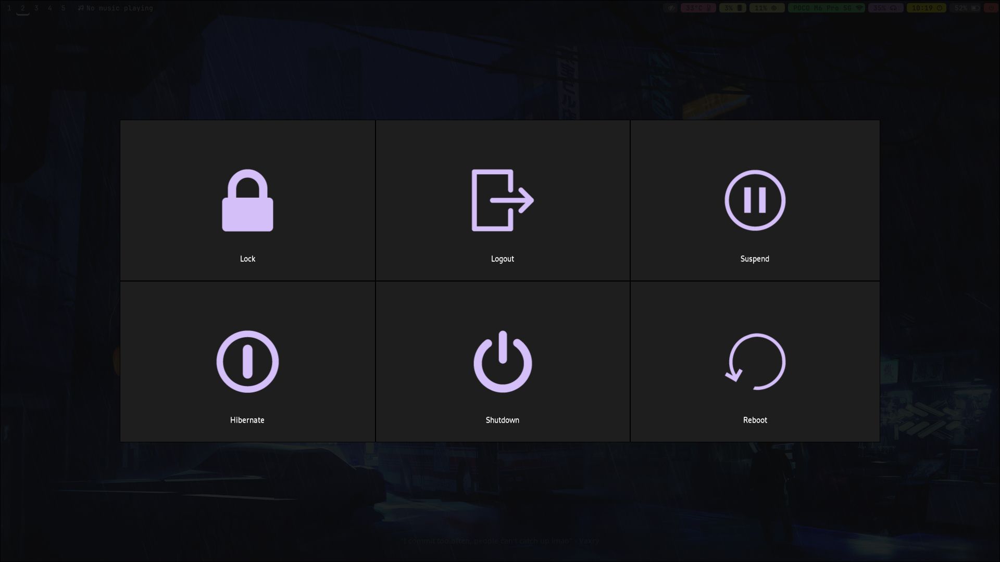

# Hyprland Config

- This is my personal configuration for Hyprland.

# Installation

```bash
bash ./install.sh
```

# Application used

## Tools on waybar
- blueman-manager --> bluetooth
- wiremix --> media I/O
- gnome-calender --> calender
- playerctl --> media handling
- wlogout --> power menu

- checkout [keybinds](./keybinds.md)


## Screenshots

### Home screen


### Hyprlock


### Terminal


### Wofi


### Wlogout



